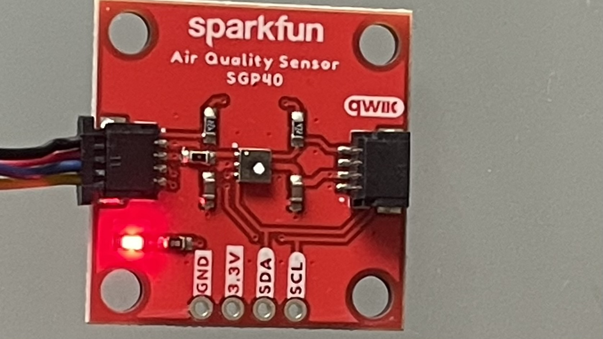

# First Time Setup Instructions

## Step 0: Hardware and Example code





The Example code is from [here](https://learn.sparkfun.com/tutorials/air-quality-sensor---sgp40-qwiic-hookup-guide/all).

## Step 1: Setup the Virtual Environment

First, set up a virtual environment for the project. This keeps your dependencies organized and separate from other projects.
```
python3 -m venv alviso
source alviso/bin/activate
```

## Step 2: Enable I2C Interface on Raspberry Pi

To communicate with the SGP40 sensor, the I2C interface on your Raspberry Pi needs to be enabled:

1. Run `sudo raspi-config` in the terminal.
2. Navigate to `Interfacing Options` > `I2C`.
3. Select `Enable` and then reboot your Raspberry Pi.

## Step 3: Clone the Repository

Clone the repository to get the source code on your Raspberry Pi:

```
git clone git@github.com:cpmentorship/datacollector.git
```

## Step 4: Install Required Packages

Change your directory to `datacollector` and install the required Python packages:

```
cd datacollector
pip install -r requirements.txt
```

## Step 5: Run `test.py`

Finally, run the `test.py` script to start collecting data:

```
python test.py
```


### Expected Output

Upon successful execution, you should see an output similar to the following, indicating that the sensor is operational:

```
SparkFun Qwiic Air Quality Sensor - SGP40, Example 1

Waiting 10 seconds for the SGP40 to warm-up.

SGP40 ready!

VOC Index is: 65
VOC Index is: 64
VOC Index is: 63

```
## add script to run whenever the raspberry restarted

Run this 
```
crontab -e
```
to add the cronjob at the restart of the system
```
@reboot /home/pi/dev/git/datacollector/start.sh
```


## Next Steps: Connecting to Adafruit IO

### Step 6: Adafruit IO Account Setup

1. **Create an Adafruit IO Account**: Visit [Adafruit IO](https://accounts.adafruit.com/users/sign_in) and sign up for an account if you don't already have one.
   
   Use the following credentials:
   - Username: `nathandyao`
   - Password: `alviso`

2. **Create a New Feed**: Once logged in, create a new feed for your data. This will be used to store the data collected from your sensor.

### Step 7: Create a Dashboard

1. **Dashboard Setup**: In your Adafruit IO account, navigate to the dashboards section and create a new dashboard.
   
2. **Add Chart Block**: Customize your dashboard by adding a chart block. This will visually represent the data collected from your sensor.

### Step 8: Configure Data Transmission

1. **Update the `send_data` Function**: In your `datacollector` project, locate the `send_data` function.
   
2. **Enter Adafruit IO Credentials**: Ensure your Adafruit IO credentials are correctly entered in the function.

3. **Run the Function**: This function will transmit the collected data to the feed you created in your Adafruit IO account.


